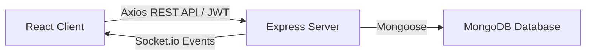
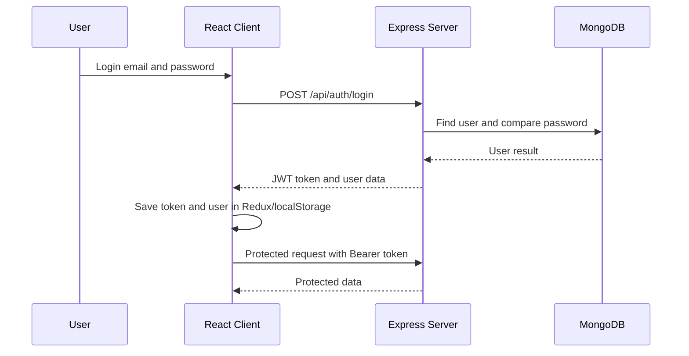

# Railway Management System

## 1. Project Overview

Railway Management System is a college project for passenger information and station operations. Passengers can search trains, see platforms and delays, read announcements, and send demo booking requests. Employees update operational information for their assigned station. Admins manage the railway data and review the system.

This is more than a train-search page because it has three secure roles, station operations, tasks, announcements, dashboards, booking requests, and real-time events.

## 2. Features

- Train search by number or name, with station and status filters in the API.
- Train details with route stops, platform, time, status, and delay reason.
- Station board with departures, announcements, and Socket.io refreshes.
- Employee operational updates for platform, delay, status, and estimated times.
- Employee task status updates.
- Admin station, employee assignment, announcement, train, and booking management.
- Passenger favourites API and demo booking requests.
- Passenger booking history, mock PNR lookup, simulated wallet top-ups/refunds, food vendor ordering, food status tracking, and admin user blocking.
- JWT login, bcrypt passwords, protected routes, Redux state, and responsive UI.
- Socket.io events named `trainUpdated`, `announcementCreated`, `bookingUpdated`, `foodOrderUpdated`, and `walletUpdated`.

## 3. Architecture



React renders the browser interface. Express receives HTTP requests. MongoDB stores the records. Mongoose describes and validates MongoDB documents. JWT proves who is logged in. Redux Toolkit stores shared client state. Socket.io sends immediate updates from the server to connected browsers.

## 4. Folder Structure

- `client/src/api`: Axios and Socket.io connections.
- `client/src/app`: Redux store.
- `client/src/features`: auth, train, station, announcement, task, and booking state.
- `client/src/pages`: public, passenger, employee, and admin screens.
- `client/src/routes`: protected route rules.
- `server/models`: MongoDB schemas.
- `server/controllers`: request logic.
- `server/routes`: endpoint definitions and middleware.
- `server/middleware`: authentication, roles, validation, errors, and 404 handling.
- `server/socket`: Socket.io connection setup.
- `server/utils`: token and seed utilities.
- `postman`: API collection.

## 5. Startup Guide

Required: Node.js 22+, npm, and MongoDB Atlas or local MongoDB. From the project root:

```powershell
cd server
copy .env.example .env
npm install
npm run seed
npm run dev
```

Set `MONGO_URI`, `JWT_SECRET`, `JWT_EXPIRES_IN`, `CLIENT_URL`, and `NODE_ENV` in `server/.env`. In another terminal:

```powershell
cd client
copy .env.example .env
npm install
npm run dev
```

Open `http://localhost:5173`. Demo users:

- Admin: `admin@railway.com` / `Admin@123`
- Employee: `employee@railway.com` / `Employee@123`
- Passenger: `passenger@railway.com` / `Passenger@123`

The seed command clears this project's collections and inserts demo records. Docker:

```powershell
docker compose up --build
```

Vercel can build `client` with `npm run build` and publish `client/dist`. Render can run `server` with `npm start`; set the environment variables in the Render dashboard and use MongoDB Atlas.

## 5A. Deployment Guide: GitHub + Render + Vercel

### Step 1: Push code to GitHub

```bash
git add .
git commit -m "Prepare deployment"
git branch -M main
git remote add origin <repository-url>
git push -u origin main
```

### Step 2: Create MongoDB Atlas

1. Open MongoDB Atlas.
2. Create a cluster and a database user.
3. Allow network access to your app IP or use `0.0.0.0/0` for testing.
4. Copy the connection string and set it as `MONGO_URI`.

### Step 3: Configure Render backend

Create a Web Service on Render and set:

```env
PORT=5000
MONGO_URI=mongodb+srv://<user>:<password>@cluster.mongodb.net/railway-management-system
JWT_SECRET=replace_with_a_long_secure_secret
JWT_EXPIRES_IN=7d
CLIENT_URL=https://YOUR-VERCEL-FRONTEND.vercel.app
NODE_ENV=production
```

Use the backend start command:

```bash
npm install
npm start
```

### Step 4: Configure Vercel frontend

1. Import the project into Vercel.
2. If the app is inside the `client` folder, set the project root accordingly.
3. Add the following environment variables:

```env
VITE_API_URL=https://YOUR-RENDER-BACKEND.onrender.com/api
VITE_SOCKET_URL=https://YOUR-RENDER-BACKEND.onrender.com
```

4. Deploy the frontend.
5. Update `CLIENT_URL` in Render after the frontend uses its final Vercel URL.

### Step 5: Test the backend health endpoint

```bash
curl https://YOUR-RENDER-BACKEND.onrender.com/api/health
```

Expected result:

```json
{
  "success": true,
  "message": "Railway Management System API is running",
  "timestamp": "2026-09-09T12:00:00.000Z"
}
```

### Step 6: GitHub Actions CI

The workflow in `.github/workflows/ci.yml` runs on every push and pull request. It installs frontend dependencies, runs a frontend production build, installs backend dependencies, and performs a backend syntax check. It never stores secrets in the repository and expects deployment secrets to be added through GitHub Secrets.

### Common deployment errors

- CORS error: verify `CLIENT_URL` and `VITE_API_URL` are set to the deployed domains.
- Build failure: test `npm run build` locally before pushing.
- MongoDB connection failure: confirm Atlas connection string and database credentials.
- Invalid environment variable: check empty values, wrong hosts, or missing `NODE_ENV`.
- Socket.io connection failure: ensure `VITE_SOCKET_URL` points to the backend domain only, not `/api`.
- React refresh 404 error: use a Vercel rewrite fallback for SPA routes.

### Deployment checklist

- [ ] Repository is pushed to GitHub
- [ ] MongoDB Atlas database is ready
- [ ] Render backend environment variables are filled in
- [ ] Vercel frontend environment variables are filled in
- [ ] `CLIENT_URL` matches the deployed Vercel URL
- [ ] `/api/health` returns a successful response
- [ ] GitHub Actions passes

## 6. Course Topic Mapping

| No. | Topic                                    | Where Implemented                   | Main Files                                                                      | Simple Explanation                                                                              |
| --- | ---------------------------------------- | ----------------------------------- | ------------------------------------------------------------------------------- | ----------------------------------------------------------------------------------------------- |
| 1   | Responsive interactive UIs with Tailwind | Public and role screens             | `client/src/index.css`, `client/src/pages`                                      | Tailwind classes resize and style the screens. Demonstrate by resizing the browser.             |
| 2   | React Hooks                              | Forms, fetching, theme, sockets     | `client/src/pages`, `client/src/context/ThemeContext.jsx`, `client/src/hooks`   | `useState` stores UI values, `useEffect` loads data, and custom hooks reuse login/socket logic. |
| 3   | Redux or Context state                   | Shared application state            | `client/src/app/store.js`, `client/src/features`                                | Redux keeps auth, trains, tasks, stations, announcements, and bookings consistent.              |
| 4   | REST API and MongoDB                     | All server data routes              | `server/routes`, `server/models`, `server/config/db.js`                         | Express routes call Mongoose models to read and save MongoDB data.                              |
| 5   | Secure REST APIs                         | JWT, roles, validation, errors      | `server/middleware`, `server/validators`                                        | Middleware blocks missing tokens and wrong roles before controllers run.                        |
| 6   | JWT roles                                | Login and protected pages           | `server/controllers/authController.js`, `client/src/features/auth/authSlice.js` | Login returns a token; the client sends it as a Bearer token.                                   |
| 7   | Postman validation                       | API collection                      | `postman/Railway-Management-System.postman_collection.json`                     | Run login, search, invalid, and role-denial requests in Postman.                                |
| 8   | WebSockets                               | Live train and announcement refresh | `server/socket/socketHandler.js`, `client/src/hooks/useSocket.js`               | A server update emits an event and the station board reloads.                                   |
| 9   | CI/CD deployment                         | Automated build check               | `.github/workflows/ci.yml`                                                      | GitHub Actions installs and builds the client on pushes and pull requests.                      |
| 10  | Docker DevOps                            | Container setup                     | `docker-compose.yml`, `client/Dockerfile`, `server/Dockerfile`                  | Docker runs MongoDB, API, and frontend in repeatable containers.                                |

## 7. API Documentation

| Method         | Endpoint                    | Access         | Purpose                     |
| -------------- | --------------------------- | -------------- | --------------------------- |
| POST           | `/api/auth/register`        | Public         | Register passenger          |
| POST           | `/api/auth/login`           | Public         | Login                       |
| GET            | `/api/auth/me`              | Authenticated  | Current user                |
| GET            | `/api/auth/employees`       | Admin          | List employees              |
| PUT            | `/api/auth/employees/:id`   | Admin          | Assign employee             |
| GET            | `/api/trains`               | Public         | List/filter trains          |
| GET            | `/api/trains/search?query=` | Public         | Search trains               |
| GET            | `/api/trains/:id`           | Public         | Train details               |
| POST           | `/api/trains`               | Admin          | Create train                |
| PUT            | `/api/trains/:id`           | Admin/Employee | Edit train or operations    |
| DELETE         | `/api/trains/:id`           | Admin          | Delete train                |
| POST           | `/api/trains/:id/favourite` | Passenger      | Toggle favourite            |
| GET/POST       | `/api/stations`             | Public/Admin   | List or create stations     |
| GET/PUT/DELETE | `/api/stations/:id`         | Public/Admin   | Station detail/manage       |
| GET            | `/api/announcements`        | Public         | List announcements          |
| POST/PUT       | `/api/announcements`        | Admin/Employee | Create or edit announcement |
| DELETE         | `/api/announcements/:id`    | Admin          | Delete announcement         |
| GET            | `/api/tasks/my-tasks`       | Employee       | Own tasks                   |
| POST           | `/api/tasks`                | Admin          | Assign task                 |
| PUT            | `/api/tasks/:id`            | Employee       | Update own task status      |
| POST           | `/api/bookings`             | Passenger      | Demo booking request        |
| GET            | `/api/bookings/my-bookings` | Passenger      | Own requests                |
| GET/PUT        | `/api/bookings` or `/:id`   | Admin          | Review/update requests      |
| GET            | `/api/dashboard/admin`      | Admin          | Admin statistics            |
| GET            | `/api/dashboard/employee`   | Employee       | Station statistics          |
| GET            | `/api/dashboard/passenger`  | Passenger      | Passenger data              |

## 8. Database Documentation

`User` references a station and favourite trains. `Train` references source, destination, and route-stop stations. `Announcement` references a station, optional train, and creator. `EmployeeTask` references an employee and station. `Booking` references a passenger, train, boarding station, and destination station. All models use timestamps where appropriate. Passwords are hashed and removed from responses.

## 9. Authentication Flow



The client sends credentials. The server finds the user and compares the bcrypt hash. A signed JWT is returned. Axios attaches it to later requests. Middleware verifies it and loads the user before protected controllers run.

## 10. Viva Questions and Answers

1. **What is your project?** A railway passenger-information and station-operations system.
2. **Why build it?** To make train and platform information easier to manage and understand.
3. **What problem does it solve?** Unclear train timing, platform, delay, and announcement information.
4. **Why three roles?** Each role needs different permissions.
5. **What is React?** A library for building interactive user interfaces.
6. **What is Tailwind?** Utility CSS classes used to style responsive screens quickly.
7. **What is useState?** A Hook for storing changing component values.
8. **What is useEffect?** A Hook for work such as API calls after rendering.
9. **What is useContext?** A way to share values such as theme without passing props everywhere.
10. **What is a custom hook?** A reusable function containing React Hook logic.
11. **Why Redux Toolkit?** It keeps shared data predictable across pages.
12. **What is an API?** A contract that lets programs communicate.
13. **What is REST?** An HTTP style using resources and methods such as GET and POST.
14. **What is Express?** A Node.js web framework.
15. **What is MongoDB?** A document database.
16. **What is Mongoose?** A library that defines and validates MongoDB documents.
17. **What is a schema?** The expected shape and rules for data.
18. **What is CRUD?** Create, Read, Update, and Delete.
19. **What is JWT?** A signed token used to identify a logged-in user.
20. **Why hash passwords?** A database leak should not reveal the original passwords.
21. **What is bcrypt?** A slow password hashing library.
22. **What is middleware?** Code that runs between request and controller.
23. **What are HTTP status codes?** Numbers describing results such as 200, 401, and 404.
24. **What is CORS?** A browser rule controlling which origins may call the API.
25. **What is Postman?** A tool for testing APIs.
26. **How does employee authorization work?** JWT role middleware checks employee access and controllers check assigned station ownership.
27. **What blocks passengers from editing trains?** Route role middleware permits only admin or employee roles.
28. **What is Socket.io?** A library for two-way real-time browser/server events.
29. **Why WebSockets?** A station board can receive changes without polling manually.
30. **What is Docker?** A way to package an application and its dependencies.
31. **Why Compose?** It starts related containers together.
32. **What is CI/CD?** Automated checking and delivery of code.
33. **What does GitHub Actions do?** It builds the client and checks server syntax on pushes.
34. **How would you deploy it?** Build the client on Vercel, run the server on Render, and use Atlas for MongoDB.
35. **What future improvements exist?** Real provider integrations, stronger audit logs, notifications, monitoring, and production deployment secrets.
36. **How does a booking reduce availability?** The booking controller decrements the selected class inventory after a paid demo booking.
37. **How does cancellation restore seats?** A paid cancellation refunds the wallet and increments the matching class inventory.
38. **Why is the wallet debit atomic?** A conditional MongoDB update prevents two requests from spending the same balance.
39. **Why are demo PNRs exactly ten digits?** The seed and booking generator create ten-digit values for the mock PNR workflow.
40. **What does the academic disclaimer mean?** All money, tickets, locations, and delivery statuses are simulated and have no real railway or payment effect.

## 11. Teacher Demonstration Script

1. Open the landing page and show the RC Rail Center branding.
2. Search for Rajdhani by name and 12301 by number.
3. Open the station board.
4. Login as the passenger and open a train detail.
5. Submit a clearly labelled demo booking request.
6. Login as employee and open operations.
7. Change a platform or delay and publish an announcement.
8. Keep a station board open to show Socket.io refresh.
9. Login as admin and open dashboard analytics.
10. Open management to assign stations and update booking status.
11. Open Postman and run authenticated and unauthorized requests.

## 12. Troubleshooting

- **MongoDB error:** Check `server/.env`, confirm `MONGO_URI`, Atlas network access, and credentials.
- **JWT error:** Remove `localStorage` key `rms_token`, log in again, and confirm `JWT_SECRET` is set.
- **CORS error:** Set `CLIENT_URL=http://localhost:5173` and restart the server.
- **Client cannot reach API:** Start the server on port 5000 and check `client/.env` `VITE_API_URL`.
- **Port in use:** Change `PORT` or stop the process using port 5000.
- **Seed fails:** Confirm MongoDB works, then rerun `npm run seed` inside `server`.
- **No data:** Run the seed command and refresh after login.
- **Socket fails:** Start the backend, confirm `VITE_SOCKET_URL`, and check the browser console.
- **Docker fails:** Run `docker compose down`, then `docker compose up --build` from the project root.
